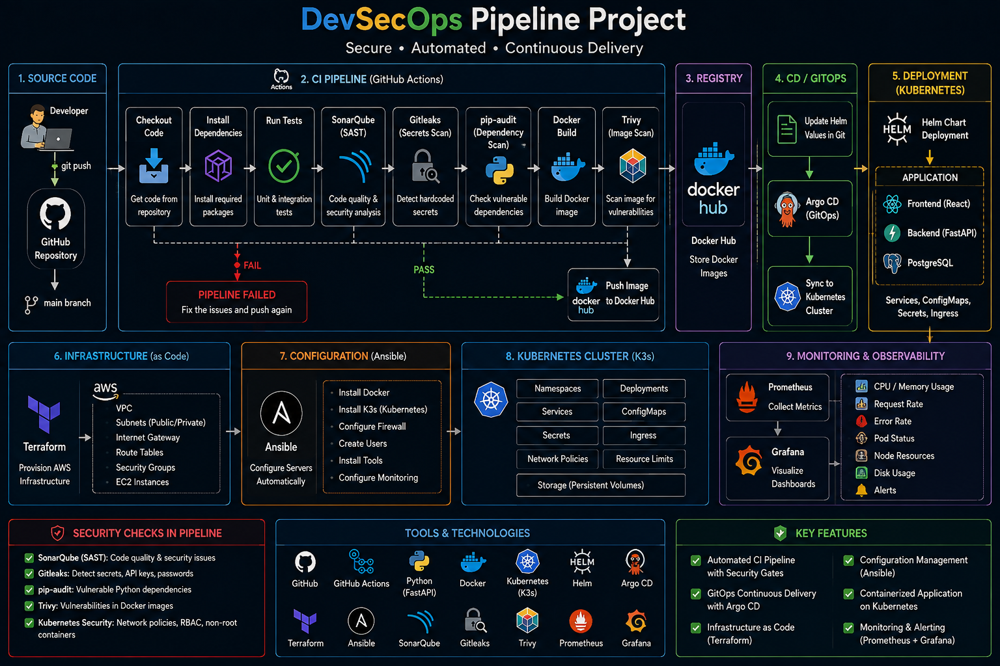

<div align="center">

# 🍔 Food Delivery Application Monitoring Framework
### Cloud-Native Monitoring & Observability Stack on AWS

<p align="center">


</p>

Production-ready, cloud-native monitoring stack providing end-to-end observability, automated infrastructure provisioning, and localized telemetry configuration for a food delivery application framework.

</div>

---

# 📑 Table of Contents

- Overview
- Architecture
- Tech Stack
- Project Structure
- Cloud Engineering Workflow
- Infrastructure Provisioning
- Configuration Management
- CI Pipeline Security (DevSecOps)
- GitOps Continuous Delivery
- Kubernetes Deployment & Resources
- Monitoring & Observability
- Visual Dashboards & Verification
- Deployment Guide
- Author

---

# 🚀 Overview

This project implements an automated, scalable infrastructure and localized monitoring framework for a food delivery platform.

The entire cloud architecture is provisioned on **AWS EC2** hosting a lightweight **K3s Kubernetes Cluster**. The system relies on Terraform for infrastructure as code, Ansible for automated system configuration, and a dedicated, production-grade telemetry pipeline built using Prometheus and Grafana to track runtime environments dynamically.

---

# 🏗 Architecture

<p align="center">
  
</p>

---

# 📁 Project Structure

```text
devsecops-project
│
├── terraform/          # AWS Core Infrastructure Configuration
├── ansible/            # Cluster Configuration & Tooling Playbooks
├── k8s/                # Localized Core Kubernetes Manifests
├── monitoring/         # Prometheus & Grafana Configuration Files
└── docs/
    └── images/         # Documentation & Dashboard Screenshots
🔒 CI Pipeline Security (DevSecOps)
Every commit triggers a secure GitHub Actions pipeline that enforces "Shift-Left" security testing before artifact creation:

SAST: Source code analysis.

Secret Scanning: Detecting hardcoded credentials.

Dependency Audit: Scanning for vulnerable packages.

Container Image Scan: Auditing Docker images before pushing to registry.

🔄 GitOps Continuous Delivery
Automated deployment is managed via Argo CD, maintaining the desired state of the Kubernetes cluster directly from Git configuration:

☸ Kubernetes Deployment & Resources
The application platform and monitoring layers run inside the managed K3s cluster ecosystem, utilizing declarative manifests for resources:

Self-Healing: Deployments ensuring high availability.

Traffic Management: NGINX Ingress configuration securely routing paths.

🖼️ Monitoring & Observability (Grafana)
A dedicated telemetry pipeline explicitly focused on cluster diagnostics and performance metrics visualization:

📊 Prometheus Targets & Alerts
Verification of active endpoints scraping status and configured cluster threshold limits:

⚙ Deployment Guide
1. Provision AWS Resources
Bash
cd terraform/
terraform init
terraform apply -auto-approve
2. Configure Node Environments
Bash
cd ../ansible/
ansible-playbook -i inventory.ini site.yml
3. Deploy Kubernetes & Telemetry Components
Bash
kubectl apply -f k8s/
kubectl apply -f monitoring/
4. Verify System Deployment
Bash
kubectl get pods -A
kubectl get svc -n monitoring
👨‍💻 Author
Ahmed Hamed

Cloud Engineer

GitHub: github.com/ahmed1707hamed-tech

LinkedIn: linkedin.com/in/ahmed-hamed-340570364

⭐ If you found this project useful, don't forget to give it a Star!
