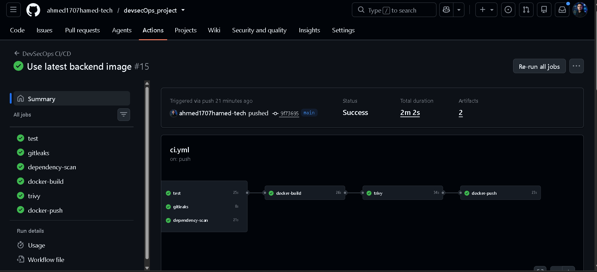
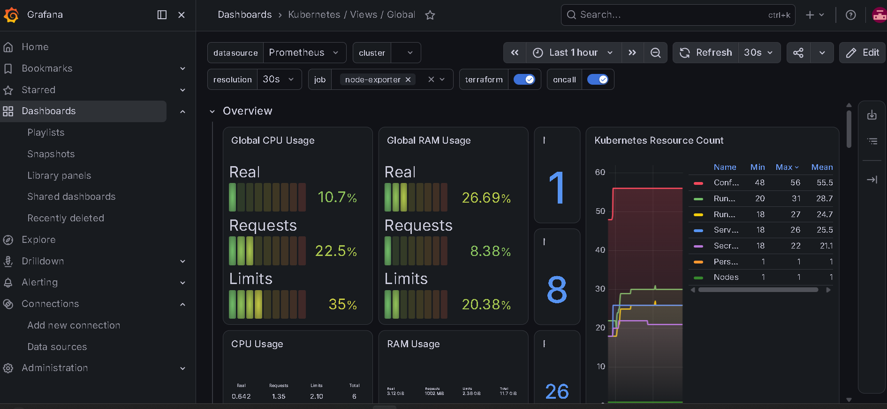
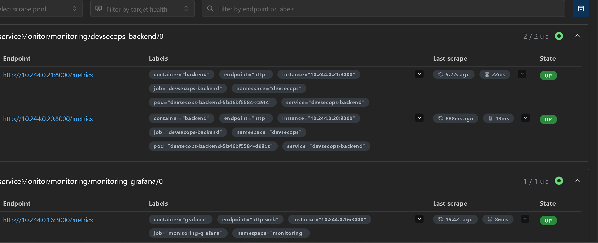

<div align="center">

# 🛡️ DevSecOps Project

### End-to-End DevSecOps CI/CD Pipeline with Kubernetes, GitOps & Monitoring

<p align="center">


</p>

A complete DevSecOps project demonstrating automated testing, security scanning, containerization, Kubernetes deployment, GitOps continuous delivery, and application monitoring.

</div>

---

# 📑 Table of Contents

- [Overview](#-overview)
- [Architecture](#-architecture)
- [DevSecOps Workflow](#-devsecops-workflow)
- [DevSecOps Security Pipeline](#-devsecops-security-pipeline)
- [GitHub Actions CI/CD](#-github-actions-cicd)
- [Docker](#-docker)
- [Docker Hub](#-docker-hub)
- [Kubernetes](#-kubernetes)
- [Helm](#-helm)
- [GitOps with Argo CD](#-gitops-with-argo-cd)
- [Monitoring & Observability](#-monitoring--observability)
- [Prometheus](#-prometheus)
- [Grafana](#-grafana)
- [Infrastructure as Code](#-infrastructure-as-code)
- [Configuration Management](#-configuration-management)
- [Technology Stack](#-technology-stack)
- [Project Structure](#-project-structure)
- [Complete CI/CD Flow](#-complete-cicd-flow)
- [Deployment](#-deployment)
- [Screenshots](#-screenshots)
- [Key Features](#-key-features)
- [Future Improvements](#-future-improvements)
- [Author](#-author)

---

# 🚀 Overview

This project demonstrates a complete **DevSecOps lifecycle** starting from source code development and automated testing to secure container image creation, Kubernetes deployment, GitOps continuous delivery, and monitoring.

The backend application is built using **FastAPI** with **PostgreSQL** as the database.

The application is containerized using Docker and deployed to Kubernetes using Helm.

Security is integrated directly into the CI/CD pipeline using:

- Pytest
- Gitleaks
- pip-audit
- Trivy

Docker images are published to Docker Hub and deployed to Kubernetes.

**Argo CD** is used to implement GitOps and continuously synchronize the Kubernetes cluster with the desired configuration stored in Git.

The Kubernetes environment is monitored using **Prometheus and Grafana**.

---

# 🏗️ Architecture

<p align="center">

</p>

The architecture follows this flow:

```text
Developer
    │
    ▼
GitHub Repository
    │
    ▼
GitHub Actions
    │
    ├── Pytest
    ├── Gitleaks
    ├── pip-audit
    ├── Docker Build
    └── Trivy
    │
    ▼
Docker Hub
    │
    ▼
Argo CD
    │
    ▼
Kubernetes Cluster
    │
    ├── FastAPI Backend
    │
    └── PostgreSQL
    │
    ▼
Prometheus
    │
    ▼
Grafana
```

---

# 🔄 DevSecOps Workflow

<p align="center">

</p>

The complete DevSecOps workflow is:

```text
Developer
    │
    ▼
Git Push
    │
    ▼
GitHub
    │
    ▼
GitHub Actions
    │
    ├───────────────┐
    │               │
    ▼               ▼
  Tests          Security
    │               │
    │       ┌───────┼────────┐
    │       ▼       ▼        ▼
    │   Gitleaks pip-audit Trivy
    │
    └───────────────┐
                    ▼
              Docker Build
                    │
                    ▼
                Docker Hub
                    │
                    ▼
                 Argo CD
                    │
                    ▼
               Kubernetes
                    │
          ┌─────────┴─────────┐
          ▼                   ▼
       Backend             PostgreSQL
          │
          ▼
      Prometheus
          │
          ▼
       Grafana
```

---

# 🛡️ DevSecOps Security Pipeline

Security is integrated into the CI/CD pipeline instead of being performed only after deployment.

| Security Stage | Tool | Purpose |
|---|---|---|
| Automated Testing | Pytest | Validate application functionality |
| Secret Scanning | Gitleaks | Detect exposed secrets |
| Dependency Scanning | pip-audit | Detect vulnerable Python dependencies |
| Container Scanning | Trivy | Detect HIGH and CRITICAL vulnerabilities |
| Image Validation | Docker | Build reproducible application containers |

The pipeline blocks the delivery process when critical security checks fail.

---

# ⚙️ GitHub Actions CI/CD

<p align="center">

</p>

The GitHub Actions workflow is triggered when code is pushed to the `main` branch.

The pipeline performs the following stages:

```text
Checkout Code
      │
      ▼
Setup Python
      │
      ▼
Install Dependencies
      │
      ▼
Run Pytest
      │
      ▼
Gitleaks Secret Scan
      │
      ▼
pip-audit Dependency Scan
      │
      ▼
Docker Build
      │
      ▼
Trivy Image Scan
      │
      ▼
Docker Hub Push
```

### CI/CD Jobs

```text
1. test
2. gitleaks
3. dependency-scan
4. docker-build
5. trivy
6. docker-push
```

### Test Stage

PostgreSQL is started as a GitHub Actions service container.

The backend dependencies are installed and automated tests are executed using:

```bash
pytest -v
```

### Secret Scanning

Gitleaks scans the repository for accidentally committed secrets and credentials.

### Dependency Security

`pip-audit` checks Python dependencies against known vulnerabilities.

### Container Security

Trivy scans the generated Docker image and fails the pipeline when HIGH or CRITICAL vulnerabilities are detected.

### Docker Publishing

After all security checks pass, the image is tagged and pushed to Docker Hub.

---

# 🐳 Docker

The FastAPI backend is containerized using Docker.

The CI pipeline creates an immutable image using the Git commit SHA:

```text
devsecops-backend:<commit-sha>
```

The image is then tagged as:

```text
ahmed7amed9/devsecops-backend:latest
```

and:

```text
ahmed7amed9/devsecops-backend:<commit-sha>
```

The Docker workflow is:

```text
Docker Build
     │
     ▼
Docker Image
     │
     ▼
Trivy Security Scan
     │
     ▼
Docker Hub
     │
     ▼
Kubernetes
```

---

# 🐳 Docker Hub

Docker Hub is used as the container registry.

Repository:

```text
ahmed7amed9/devsecops-backend
```

Images are published automatically by GitHub Actions after the security pipeline succeeds.

---

# ☸️ Kubernetes

The application is deployed to a Kubernetes cluster.

### Namespace

```text
devsecops
```

### Backend Deployment

```text
Deployment: devsecops-backend
Replicas: 3
```

The backend runs three replicas to provide basic availability and allow Kubernetes to distribute workload between pods.

Current deployment image:

```text
ahmed7amed9/devsecops-backend:latest
```

### Backend Service

```text
Service: devsecops-backend
Type: NodePort
Port: 8000
NodePort: 30080
```

### PostgreSQL

```text
Deployment: devsecops-postgres
Service: devsecops-postgres
Type: ClusterIP
Port: 5432
```

PostgreSQL is intentionally exposed internally through a ClusterIP service because the database does not need to be publicly accessible.

---

# ⎈ Helm

Helm is used to package and manage the Kubernetes deployment.

The Helm chart contains reusable Kubernetes templates and configurable values.

```text
helm/
└── devsecops/
    ├── Chart.yaml
    ├── values.yaml
    └── templates/
        ├── deployment.yaml
        ├── service.yaml
        ├── configmap.yaml
        └── secret.yaml
```

Example configuration:

```yaml
backend:
  replicaCount: 3

  image:
    repository: ahmed7amed9/devsecops-backend
    tag: latest
    pullPolicy: Always

  service:
    type: NodePort
    port: 8000
    targetPort: 8000
    nodePort: 30080
```

Helm allows the Kubernetes environment to be configured without modifying the underlying templates.

---

# 🔄 GitOps with Argo CD

<p align="center">

</p>

Argo CD is used to implement the GitOps deployment model.

The desired Kubernetes state is stored in Git and Argo CD continuously compares it with the actual cluster state.

```text
Git Repository
      │
      ▼
    Argo CD
      │
      ├── Detect Changes
      │
      ├── Compare Desired State
      │
      ├── Synchronize
      │
      ▼
 Kubernetes Cluster
```

### Argo CD Application

```text
Application: devsecops
Namespace: argocd
Sync Status: Synced
Health Status: Healthy
```

This provides automated and reliable Continuous Delivery.

---

# 📊 Monitoring & Observability

<p align="center">

</p>

The Kubernetes environment is monitored using:

- Prometheus
- Grafana
- Kubernetes Metrics
- Node Exporter
- Kube State Metrics

Monitoring provides visibility into the health and performance of the application and Kubernetes cluster.

---

# 🔎 Prometheus

<p align="center">

</p>

Prometheus collects metrics from Kubernetes and application components.

Metrics include:

- CPU usage
- Memory usage
- Pod status
- Node metrics
- Kubernetes resources
- Application metrics
- Request metrics

The backend exposes a Prometheus-compatible metrics endpoint:

```text
/metrics
```

Application metrics flow:

```text
FastAPI Backend
      │
      │ /metrics
      ▼
 Prometheus
      │
      ▼
   Grafana
```

---

# 📈 Grafana

Grafana is used to visualize the metrics collected by Prometheus.

Dashboards provide visibility into:

- CPU utilization
- Memory utilization
- Pod status
- Node health
- Kubernetes resources
- Application performance
- Request metrics

<p align="center">

</p>

---

# 🔐 Application Health

The backend exposes a health endpoint:

```text
/health
```

Example response:

```json
{
  "status": "healthy"
}
```

This endpoint can be used to verify that the application is running correctly.

---

# 🏗️ Infrastructure as Code

Terraform is used to provision cloud infrastructure.

The infrastructure can include:

```text
Terraform
    │
    ├── VPC
    ├── Subnets
    ├── Internet Gateway
    ├── Route Tables
    ├── Security Groups
    └── EC2
```

Infrastructure as Code provides:

- Reproducible infrastructure
- Version-controlled configuration
- Automated provisioning
- Easier environment management

---

# ⚙️ Configuration Management

Ansible is used to automate server configuration and environment preparation.

Typical tasks include:

- Installing Docker
- Installing Kubernetes / K3s
- Installing Helm
- Configuring servers
- Installing required tools
- Preparing the deployment environment

The goal is to reduce manual server configuration and make the environment reproducible.

---

# 🧰 Technology Stack

| Category | Technologies |
|---|---|
| Backend | FastAPI |
| Programming Language | Python 3.12 |
| Database | PostgreSQL 16 |
| Testing | Pytest |
| Secret Scanning | Gitleaks |
| Dependency Security | pip-audit |
| Container Security | Trivy |
| Containerization | Docker |
| Registry | Docker Hub |
| CI/CD | GitHub Actions |
| Orchestration | Kubernetes |
| Kubernetes Distribution | K3s |
| Package Management | Helm |
| GitOps | Argo CD |
| Monitoring | Prometheus |
| Visualization | Grafana |
| Infrastructure | Terraform |
| Configuration Management | Ansible |
| Version Control | Git / GitHub |

---

# 📂 Project Structure

```text
devsecops-project/
│
├── .github/
│   └── workflows/
│       └── ci.yml
│
├── backend/
│   ├── app/
│   ├── tests/
│   ├── requirements.txt
│   └── Dockerfile
│
├── helm/
│   └── devsecops/
│       ├── Chart.yaml
│       ├── values.yaml
│       └── templates/
│
├── terraform/
│   ├── main.tf
│   ├── variables.tf
│   └── outputs.tf
│
├── ansible/
│   ├── inventory/
│   ├── playbooks/
│   └── roles/
│
├── monitoring/
│   ├── prometheus/
│   └── grafana/
│
├── docs/
│   └── images/
│       ├── architecture-diagram.png
│       ├── devsecops-workflow.png
│       ├── github-actions-pipeline.png
│       ├── argocd-dashboard.png
│       ├── prometheus-targets.png
│       └── grafana-dashboard.png
│
└── README.md
```

---

# 🔁 Complete CI/CD Flow

```text
                         Developer
                             │
                             ▼
                       GitHub Repository
                             │
                             ▼
                     GitHub Actions CI
                             │
          ┌──────────────────┼──────────────────┐
          │                  │                  │
          ▼                  ▼                  ▼
       Pytest            Gitleaks          pip-audit
          │                  │                  │
          └──────────────────┼──────────────────┘
                             │
                             ▼
                       Docker Build
                             │
                             ▼
                        Trivy Scan
                             │
                             ▼
                        Docker Hub
                             │
                             ▼
                          Argo CD
                             │
                             ▼
                       Kubernetes
                             │
                    ┌────────┴────────┐
                    │                 │
                    ▼                 ▼
              FastAPI Backend     PostgreSQL
                    │
                    ▼
                Prometheus
                    │
                    ▼
                 Grafana
```

---

# 🔐 Security Lifecycle

Security is integrated throughout the software delivery lifecycle.

```text
Source Code
     │
     ▼
Automated Tests
     │
     ▼
Secret Scanning
     │
     ▼
Dependency Scanning
     │
     ▼
Docker Build
     │
     ▼
Container Vulnerability Scan
     │
     ▼
Secure Image
     │
     ▼
Docker Hub
     │
     ▼
Kubernetes Deployment
```

---

# 🚀 Deployment

## 1. Clone Repository

```bash
git clone https://github.com/ahmed1707hamed-tech/devsecops-project.git

cd devsecops-project
```

## 2. Run Tests

```bash
cd backend

pip install -r requirements.txt

pytest -v
```

## 3. Build Docker Image

```bash
docker build -t devsecops-backend:latest ./backend
```

## 4. Run Docker Container

```bash
docker run -d \
  --name devsecops-backend \
  -p 8000:8000 \
  devsecops-backend:latest
```

## 5. Deploy with Helm

```bash
helm upgrade --install devsecops ./helm/devsecops \
  -n devsecops \
  --create-namespace
```

## 6. Verify Kubernetes

```bash
kubectl get pods -n devsecops

kubectl get deployment -n devsecops

kubectl get svc -n devsecops
```

## 7. Check Backend

```bash
kubectl get deployment devsecops-backend \
  -n devsecops \
  -o jsonpath="{.spec.template.spec.containers[0].image}"
```

## 8. Check Argo CD

```bash
kubectl get application devsecops -n argocd
```

Expected:

```text
SYNC STATUS:   Synced
HEALTH STATUS: Healthy
```

---

# 📸 Project Screenshots

## 🏗️ Architecture Diagram

<p align="center">

</p>

## 🔄 DevSecOps Workflow

<p align="center">

</p>

## ⚙️ GitHub Actions CI/CD

<p align="center">

</p>

## 🔄 Argo CD

<p align="center">

</p>

## 🔎 Prometheus

<p align="center">

</p>

## 📊 Grafana

<p align="center">

</p>

---

# ✨ Key Features

- ✅ Complete DevSecOps CI/CD Pipeline
- ✅ Automated Pytest Testing
- ✅ Gitleaks Secret Detection
- ✅ pip-audit Dependency Scanning
- ✅ Trivy Container Security Scanning
- ✅ Docker Containerization
- ✅ Docker Hub Image Publishing
- ✅ Kubernetes Deployment
- ✅ Three Backend Replicas
- ✅ PostgreSQL Database
- ✅ Helm-based Kubernetes Deployment
- ✅ GitOps with Argo CD
- ✅ Prometheus Monitoring
- ✅ Grafana Dashboards
- ✅ Application Health Endpoint
- ✅ Application Prometheus Metrics
- ✅ Terraform Infrastructure as Code
- ✅ Ansible Configuration Management
- ✅ Automated Deployment Workflow

---

# 📚 Future Improvements

- HTTPS with Let's Encrypt
- Domain Name
- Kubernetes Ingress
- Horizontal Pod Autoscaler
- External Load Balancer
- Multi-Environment Deployment
- Development / Staging / Production environments
- HashiCorp Vault
- Centralized Logging with Loki
- Alerting with Alertmanager
- Slack Notifications
- SonarQube Code Quality Analysis
- SBOM Generation
- Container Image Signing
- Kubernetes Network Policies

---

# 👨‍💻 Author

<div align="center">

## Ahmed Mohammed Hamed

### Cloud & DevOps Engineer

GitHub:  
https://github.com/ahmed1707hamed-tech

LinkedIn:  
https://www.linkedin.com/in/ahmed-hamed-340570364?utm_source=share&utm_campaign=share_via&utm_content=profile&utm_medium=android_app

</div>

---

# ⭐ Project Highlights

This project demonstrates an end-to-end **DevSecOps implementation** combining:

**CI/CD + Security + Docker + Kubernetes + Helm + GitOps + Monitoring + Terraform + Ansible**

The complete workflow starts from a Git push, passes through automated testing and multiple security gates, builds and scans a Docker image, publishes it to Docker Hub, and finally deploys the application to Kubernetes through Argo CD.

The deployed environment is continuously monitored using Prometheus and Grafana.

---

<div align="center">

### 🛡️ Secure Code → 📦 Container → ☸️ Kubernetes → 🔄 GitOps → 📊 Monitoring

⭐ If you found this project useful, don't forget to give it a Star!

</div>
